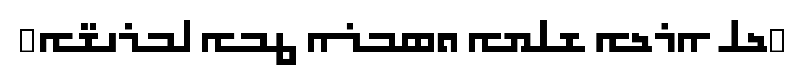

# Nohadra Syriac Fonts

Nohadra fonts are a bold, geometric, and modern monospaced Syriac typeface.

## Introduction

The Nohadra Syriac Font family includes bold, geometric, and modern monospaces Syriac typefaces with square, block-like characters and uniform line thickness. This font offers high legibility and a minimalistic design, making it ideal for headlines, signage, and digital interfaces. 

## Samples

Sapna is a monospaced and minimal block style Syriac typeface.

Amedia offers the same look and feel as Sapna, but with rounder edges.

## Installation

To install the Nohadra Syriac Fonts onto your system, follow these steps:

1. Download or clone this repository
3. Run the `install.command` script

The `install.command` script will automatically copy the font files to your system's fonts directory.

## Contributing

Contributions to the Nohadra Syriac Font project are welcome. To contribute, feel free to put up a pull request with a detailed description of your change. Note, the Makefile includes a testing target that should be run.
