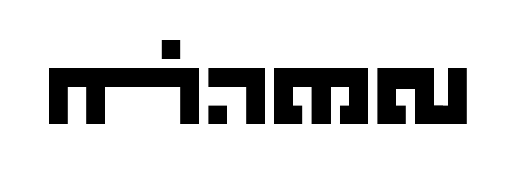
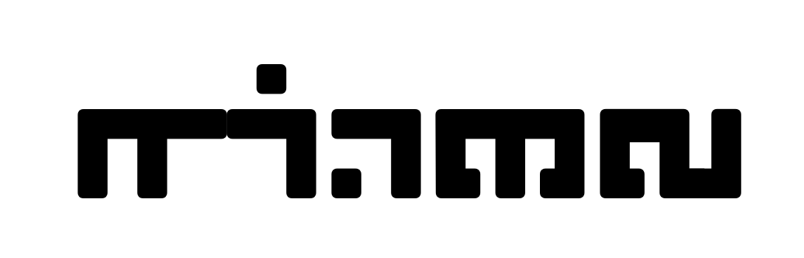
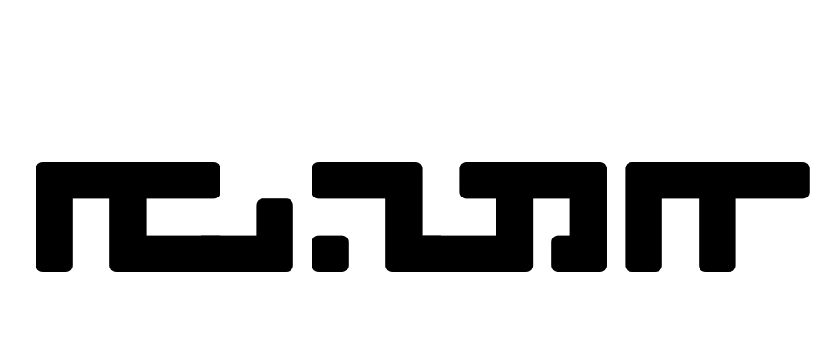
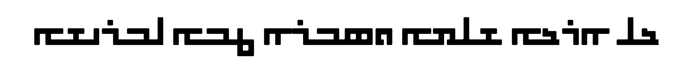

# The Nohadra Syriac Fonts Collection


Nohadra fonts are a bold, geometric, and monospaced Syriac typeface.
<p align="center">
   
</p>

## Introduction

The Nohadra Syriac Font family includes Syriac typefaces with square, block-like characters and uniform line thickness. This font offers a modern and minimalistic design and feel. 

## Samples

### Nohadra - Sapna
<p align="center">
  
</p>

Sapna is a monospaced and minimal block style Syriac typeface. [View sample text](samples/index-sapna.html)


<p align="center">
  
</p>

### Nohadra - Amedia
<p align="center">
  
</p>

Amedia offers the same look and feel as Sapna, but with rounder edges. [View sample text](samples/index-amedia.html)

<p align="center">
  
</p>

### More to come

## Installation
To install the Nohadra Syriac Font on your system, simply install the desired OTF font files from the `fonts/` directory from the latest tagged version of the project. See [latest tags](https://github.com/SargisYonan/NohadraSyriac/tags). Alternatively, follow the instructions below to get the latest beta.

First begin by downloading or cloning this repository, and navigate to the directory containing this project.

### macOS/Linux/Windows Instructions

4. Run the script:
```sh
./install_fonts.sh
```

## Contributing

Contributions to the Nohadra Syriac Font project are welcome. To contribute, feel free to put up a pull request with a detailed description of your change.

Currently, there is no CLI method for exporting font files, and thus must be exported by Glyphs.app. 

Font kerning is also verified manually currently. Pay close attention to diacritic placement in the samples to note any changes made. The `make` command should be run for all changes as it will export the Glyphs.app fonts, proof them, and create new samples.

## Licensing
The project, and fonts contained, are distributed under the SIL Open Font License (OFL). The SIL Open Font License allows the use, modification, and distribution of fonts, provided they are not sold by themselves, and any derivatives are released under the same license with a different name to avoid confusion with the original. It promotes free sharing and improvement of fonts.

