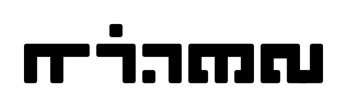
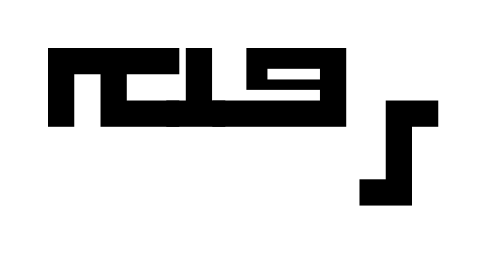
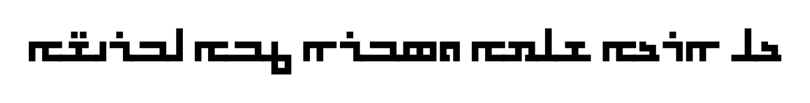
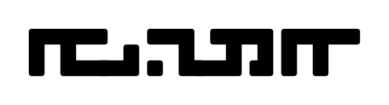
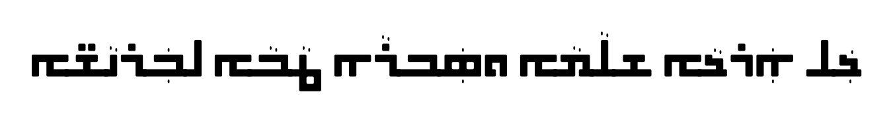
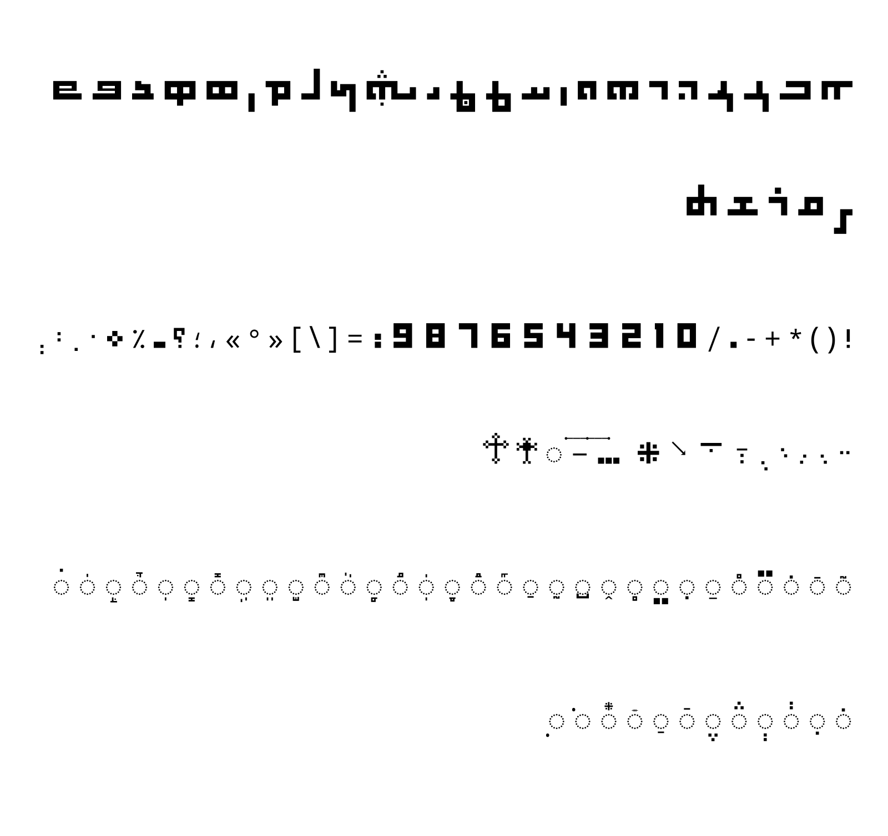
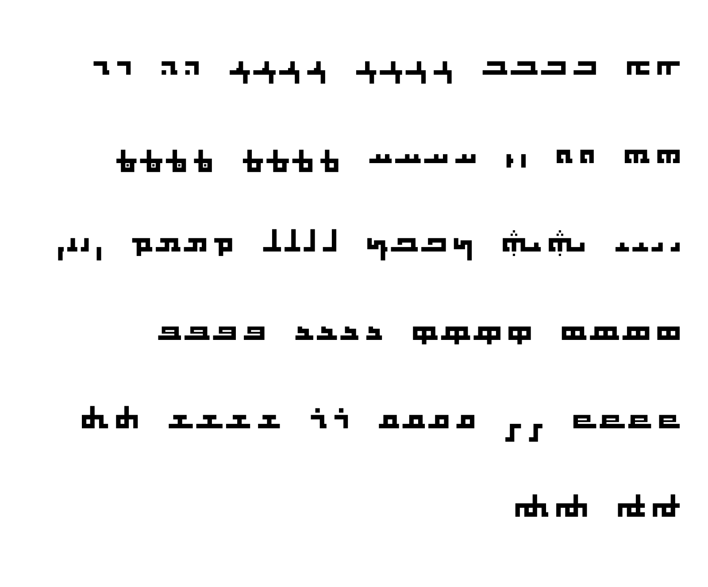
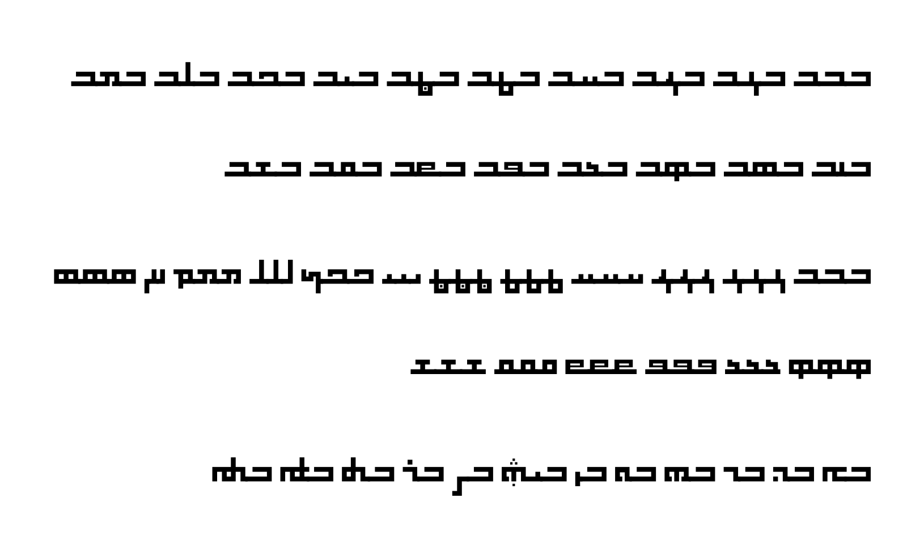
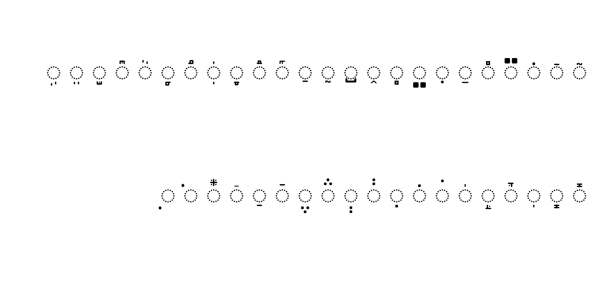

# The Nohadra Syriac Fonts Collection

[](https://github.com/SargisYonan/NohadraSyriac/actions/workflows/font-qa.yml)

Nohadra fonts are a bold, geometric, and (mostly) monospaced Syriac typeface.

<p align="center">
   
</p>

## Introduction

The Nohadra Syriac Font family includes Syriac typefaces with square, block-like characters and uniform line thickness. This font offers a modern and minimalistic design and feel.

## Samples

### Nohadra - Sapna

<p align="center">
  
</p>

Sapna is a minimal block style Syriac typeface. [View sample text](https://yonan.org/fonts/nohadrasyriac/nohadrasyriac-sapna.html)




### Nohadra - Amedia

<p align="center">
  
</p>

Amedia offers the same look and feel as Sapna, but with rounder edges. [View sample text](https://yonan.org/fonts/nohadrasyriac/nohadrasyriac-amedia.html)




### Character set and forms

| | Sapna | Amedia |
|-|-------|--------|
| Every character |  |  |
| Every letter in each of its forms |  |  |
| Joining |  |  |
| Vowels and marks |  |  |

All the images above are rendered from the built fonts by `make images`, so they always show the current fonts.

## Installation

To install the Nohadra Syriac Font on your system, simply install the desired OTF font files from the `fonts/` directory from the latest tagged version of the project. See [latest releases](https://github.com/SargisYonan/NohadraSyriac/releases). Alternatively, follow the instructions below to get the latest beta.

First begin by downloading or cloning this repository, and navigate to the directory containing this project.

### macOS/Linux/Windows Instructions

Run the script:

```sh
./install_fonts.sh
```

## Building and checking the fonts

The fonts are built from `glyphs/NohadraSyriac.glyphs` with [fontmake](https://github.com/googlefonts/fontmake), so Glyphs.app is only needed to edit the source.

    make all      # build, report, proof sheets, images, then tests
    make ci       # exactly what GitHub runs on every push

or one step at a time. Every check runs on both styles.

| Command      | What it does |
|--------------|--------------|
| `make build` | Compiles both styles to `fonts/NohadraSyriac-Sapna.otf` and `fonts/NohadraSyriac-Amedia.otf`. |
| `make qa`    | Lists problems letter by letter: joins that don't line up, gaps, ink running into the next letter, corners rounded differently from the rest, edges a unit or two off a common height, lines almost but not quite flat, marks too close to a letter, its neighbours or a mark stacked on it. |
| `make test`  | Pass/fail tests that every joint meets the connecting stroke exactly, that HarfBuzz picks the right forms and ligatures, that every vowel and mark attaches at its anchor without touching its own letter, the letters beside it, or a mark stacked on it, and that no character draws nothing (or, for spaces and joiners, something). |
| `make fontbakery` | Runs [fontbakery](https://github.com/fonttools/fontbakery)'s universal checks. Reports go to `out/fontbakery.html` and `out/fontbakery.md`. |
| `make proof` | Writes and opens `out/<style>/proof.html`: every problem circled on the glyph, every letter in every form, every joining pair, vowels and marks on every letter, punctuation and live text. |
| `make diff`  | Writes and opens `out/diff.html`: every glyph, letter pair, mark position and sample text that changed since the last release, drawn before, after and overlaid. `make diff BEFORE=<tag>` compares with another release. |
| `make images`| Renders the images above into `documentation/`. |
| `make ci`    | Rebuilds the fonts from the source, then fails on any QA error, failing test or fontbakery failure; then writes the proofs and images. |

To check fonts exported from Glyphs instead: `make qa proof test FONTS='path/to/NohadraSyriac-Sapna.otf path/to/NohadraSyriac-Amedia.otf'`.

Something flagged on purpose? Add `<glyph> <check>` to `qa/allow.txt` with a note saying why. For a mark, `<glyph> mark-neighbour <mark>` (or `mark-clearance`, `mark-stack`) excuses just that one mark.

## Contributing

Contributions to the Nohadra Syriac Font project are welcome. To contribute, feel free to put up a pull request with a detailed description of your change. Run `make all` before sending it, and `make diff` to see exactly what your change does to the fonts.

## Licensing

The project, and fonts contained, are distributed under the SIL Open Font License (OFL). The SIL Open Font License allows the use, modification, and distribution of fonts, provided they are not sold by themselves, and any derivatives are released under the same license with a different name to avoid confusion with the original. It promotes free sharing and improvement of fonts.
