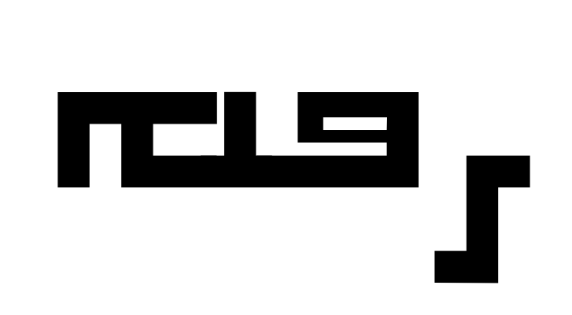

# The Nohadra Syriac Fonts Collection


Nohadra fonts are a bold, geometric, and monospaced Syriac typeface.


## Introduction

The Nohadra Syriac Font family includes Syriac typefaces with square, block-like characters and uniform line thickness. This font offers a modern and minimalistic design and feel. 

## Samples

### Nohadra - Sapna

Sapna is a monospaced and minimal block style Syriac typeface.


### Nohadra - Amedia

Amedia offers the same look and feel as Sapna, but with rounder edges.


### More to come

## Installation
To install the Nohadra Syriac Font on your system, follow the instructions for your operating system below.

First begin by downloading or cloning this repository, and navigate to the directory containing this project.

### macOS/Linux/Windows Instructions

4. Run the script:
```sh
./install_fonts.sh
```

## Contributing

Contributions to the Nohadra Syriac Font project are welcome. To contribute, feel free to put up a pull request with a detailed description of your change. Note, the Makefile includes a testing target that should be run.